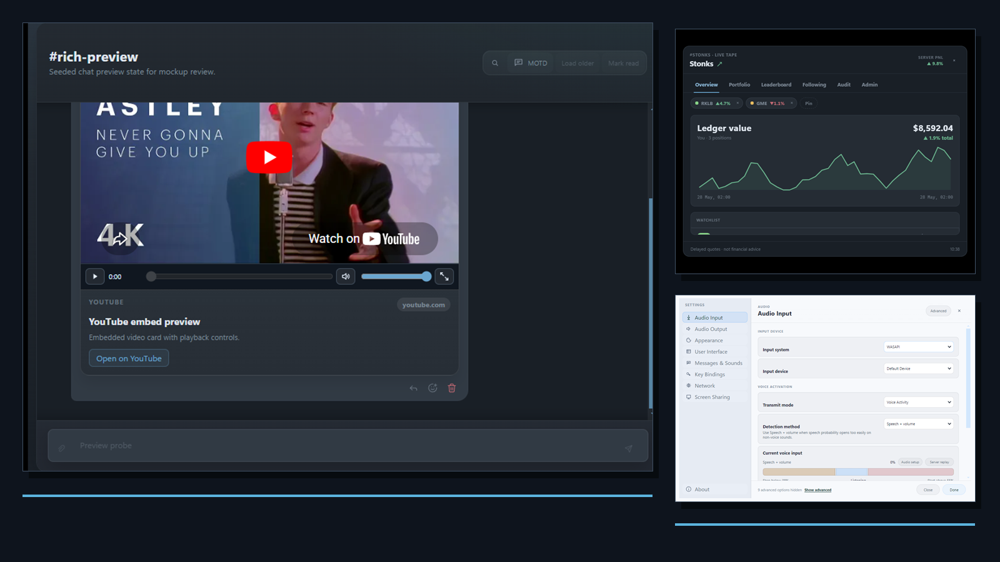
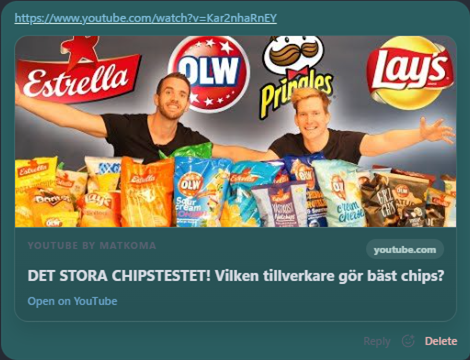
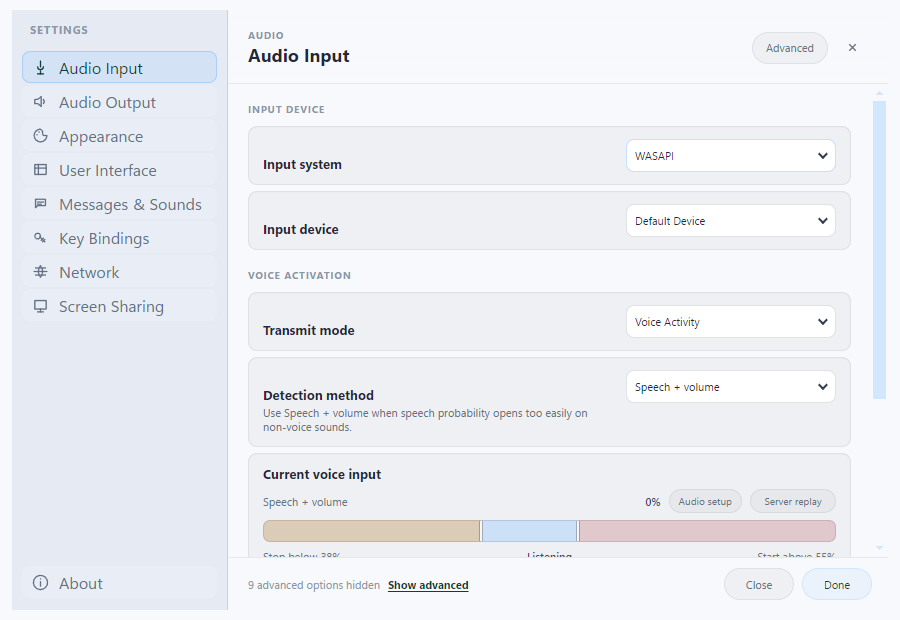
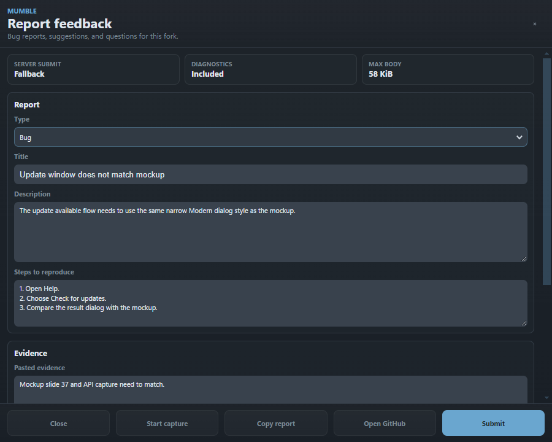
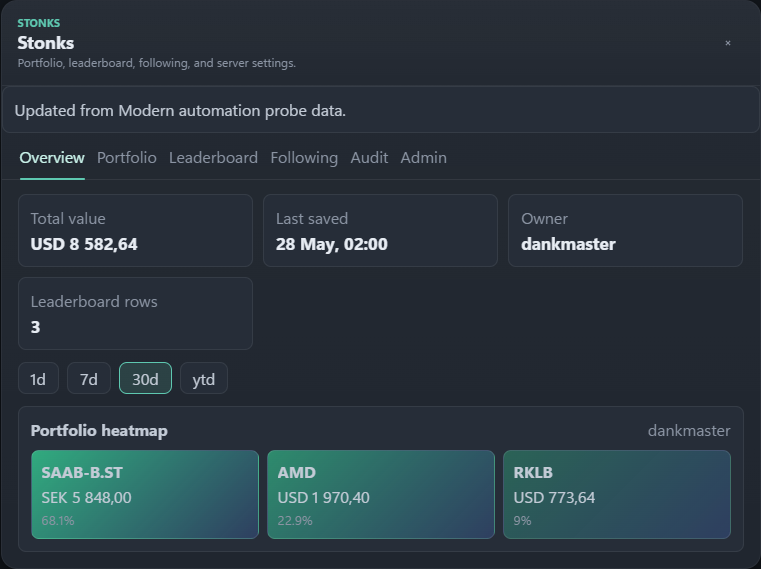
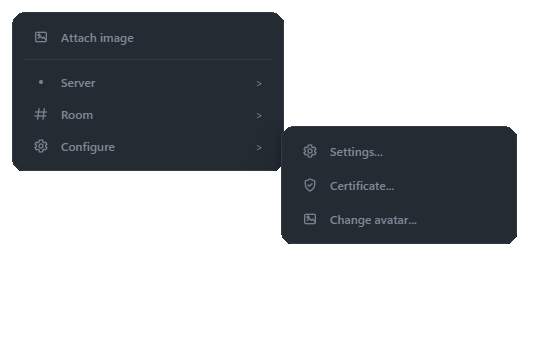
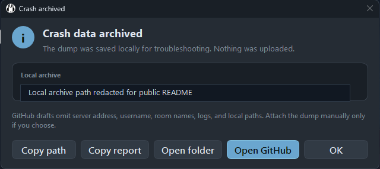

# Mumble - Dankmaster Fork

<p align="center">
  
</p>

<p align="center">
  <strong>A community-focused Mumble fork with persistent rooms, rich media previews, a modern-only client direction, screen-share experiments, and small-server release tooling.</strong>
</p>

<p align="center">
  <a href="https://www.mumble.info"></a>
  <a href="https://github.com/mumble-voip/mumble"></a>
  <a href="LICENSE"></a>
  <a href="https://github.com/dankmaster/mumble/actions/workflows/ci.yml"></a>
  <a href="https://github.com/dankmaster/mumble/actions/workflows/windows-shared-client.yml"></a>
</p>

<p align="center">
  
</p>

## What This Is

This repository is a fork of [Mumble](https://github.com/mumble-voip/mumble).
Full credit for the original project, architecture, and the vast majority of
the codebase belongs to the Mumble team and upstream contributors.

Mumble is an open source, low-latency, high-quality voice chat application
built on Qt and Opus. The project contains the desktop client, `mumble`, and
the server, `mumble-server` (formerly Murmur).

This fork is not an official Mumble release. It is an experimental,
server-specific build for one group of friends running a private community
server. The goal is to keep the core Mumble voice experience intact while
adding features that make that server feel more modern and easier to live in.
The intended fork desktop client path is now the native Qt Quick Modern shell.
Classic Qt Widgets UI is not a product path; Qt Widgets remains only for narrow
operating-system and plugin-owned surfaces while migration cleanup finishes. The server is not
modern-only: `mumble-server` must still let ordinary upstream/native Mumble
clients connect for voice and basic text behavior, with fork features gated per
client capability.

If you want the official stable Mumble project, start at
[mumble.info](https://www.mumble.info/) or
[mumble-voip/mumble](https://github.com/mumble-voip/mumble).

## Screenshots

The modern client shots are cropped or redacted from sanitized automation states
so the README can show real UI surfaces without private server data.

| Rich Preview Playback | Themeable Settings | Feedback Report |
| --- | --- | --- |
|  |  |  |

| Stonks Live Tape | Modern Context Menus | Crash Archive Guard |
| --- | --- | --- |
|  |  |  |

## Feature Inventory

The fork keeps the normal Mumble voice/chat foundation and layers a small
community feature set on top. The long-form inventory lives in
[`docs/fork-features.md`](docs/fork-features.md).

| Area | Status | Highlights |
| --- | --- | --- |
| Upstream Mumble baseline | Retained | Low-latency Opus voice, channels, ACLs, certificates, shortcuts, plugins, server tooling, and ordinary upstream/native client interoperability where practical. |
| Persistent chat | Active fork feature | Stored history for voice-room chats, dedicated text rooms, optional server-global chat, direct-message history when supported, read state, unread counts, pagination, replies, deletion, and reactions. |
| Rich media chat | Active fork feature | Chunked authenticated uploads, image/video/document/binary asset storage, preview thumbnails, inline media rendering, and quota controls. |
| Link preview cards | Active fork feature | Provider-aware cards for playable YouTube/video previews, social posts, GitHub, Steam, finance links, product/listing pages, news, maps, weather, transit, game stores, and direct media. |
| Modern client shell | Active fork direction | Native Qt Quick chat/navigator shell with typed C++ models, persistent rooms, compact message controls, rich cards, direct-message tray, room-aware composer state, theme/density variants, and Modern dialogs. WebEngine is reserved for explicit interactive media playback. |
| Finance and stonks | Active server feature | Cashtag extraction, Yahoo Finance quote cards with chart data, provider links, and a scoped `#stonks` room with scores, leaderboards, and follows. |
| Watch together | Protocol/server foundation | Capability-gated room media-session messages for synchronized direct media or YouTube playback; client UI is still a future layer. |
| Screen sharing | Experimental | Capability-gated signaling, server policy/configuration, external helper process, GStreamer LiveKit publish/view, and diagnostic logging. |
| Speech cleanup | Experimental | RNNoise, DTLN, and DeepFilterNet model paths plus local benchmark/smoke-test support for packaged Windows builds. |
| Windows fork distribution | Active fork tooling | Shared/WebEngine build lane, unsigned convenience MSI release, generated changelog, and update-manifest support for `mumble-forked`. |
| Fork identity controls | Active fork utility | Hidden advertised release/OS overrides and update-check environment overrides for controlled community deployments. |

## Repository Map

- [`src/`](src/) contains the client, server, protocol, helper, and test code.
- [`docs/status-and-roadmap.md`](docs/status-and-roadmap.md) summarizes the current fork state and near-term direction.
- [`docs/fork-features.md`](docs/fork-features.md) lists the fork-specific feature surface.
- [`docs/modern-custom-themes.md`](docs/modern-custom-themes.md) explains how to install, create, test, and share Modern shell themes.
- [`docs/fork-extension-architecture.md`](docs/fork-extension-architecture.md) covers the feature-gating model for fork experiments.
- [`docs/chat-architecture.md`](docs/chat-architecture.md) describes the fork-specific persistent chat direction.
- [`docs/rich-chat-server.md`](docs/rich-chat-server.md) covers server-side rich chat storage and configuration.
- [`docs/screen-sharing-architecture.md`](docs/screen-sharing-architecture.md) explains the screen-share architecture.
- [`docs/screen-sharing-relay-deployment.md`](docs/screen-sharing-relay-deployment.md) covers relay deployment notes.
- [`docs/dev/build-instructions/README.md`](docs/dev/build-instructions/README.md) is the upstream build documentation.
- [`docs/windows-builds.md`](docs/windows-builds.md) captures this fork's tracked Windows build notes.

## Getting Started

For most users, the easiest path is the latest `mumble-forked` Windows MSI from
this fork's GitHub releases. Install it, connect to your server as usual, and
use **Settings > Appearance** to pick a built-in Modern theme, density, accent,
or a custom theme file.

If you are running a server for the fork features:

1. Start from the sample [`mumble-server.ini`](auxiliary_files/mumble-server.ini).
2. Enable only the fork features you intend to operate, such as persistent chat,
   rich chat assets, previews, or screen-share relay settings.
3. Keep ordinary Mumble compatibility in mind. Fork features are
   capability-gated, so upstream/native clients should still be able to connect
   for baseline voice and basic text.
4. Read [`docs/status-and-roadmap.md`](docs/status-and-roadmap.md) before
   depending on experimental features such as screen sharing or speech cleanup.

If you are hacking on the client, build the shared Qt Quick/WebEngineQuick lane.
The native QML shell is the only product surface; Qt Widgets is restricted to
the documented operating-system and third-party-plugin allowlist.

## Building

General Mumble build instructions live in
[`docs/dev/build-instructions/README.md`](docs/dev/build-instructions/README.md).
Those docs are version-specific, so make sure you are reading them from the
branch you intend to build.

For this fork, the main CMake switches are still the standard Mumble ones:

```bash
cmake -S . -B build
cmake --build build --parallel
```

Useful optional features in this tree include:

```bash
-Dclient=ON
-Dserver=ON
-Dscreen-helper=ON
-Drnnoise=ON
-Ddtln=ON
-Ddeepfilternet=ON
```

Windows-specific notes for the tracked build flow are in
[`docs/windows-builds.md`](docs/windows-builds.md).

## Modding And Themes

The supported end-user modding surface today is the Modern shell theme system.
Custom themes are CSS-token files, not arbitrary JavaScript or unrestricted CSS.
That keeps theme preview fast, makes native-window color bridging predictable,
and avoids turning themes into a plugin permission model.

Quick theme flow:

1. Open **Settings > Appearance > Custom themes > Open folder**.
2. Copy a `.css` token theme into the opened `ModernThemes` folder.
3. Reopen Settings or switch away/back to refresh the theme grid.
4. Pick the custom theme and optionally combine it with a built-in or custom
   accent.

The full guide, including a minimal theme template and the supported token
contract, lives in [`docs/modern-custom-themes.md`](docs/modern-custom-themes.md).

## Server Configuration

The server configuration template is
[`auxiliary_files/mumble-server.ini`](auxiliary_files/mumble-server.ini).

Fork-specific settings include:

```ini
persistentglobalchat=false
chat_asset_storage_path=chat-assets
chat_asset_max_bytes=26214400
chat_asset_total_quota_bytes=2147483648
chat_attachment_limit=4
chat_preview_fetch_enabled=false
chat_preview_client_assist_enabled=true
chat_preview_client_assist_lease_ms=30000
chat_preview_client_assist_fallback_ms=3500
chat_preview_client_assist_thumbnail_max_bytes=524288

screen_share_enabled=false
screen_share_relay_url="wss://relay.example.com/mumble-screen"
screen_share_max_width=2560
screen_share_max_height=1440
screen_share_max_fps=144
```

Persistent chat media storage is documented in
[`docs/rich-chat-server.md`](docs/rich-chat-server.md). Screen-share relay
deployment is documented in
[`docs/screen-sharing-relay-deployment.md`](docs/screen-sharing-relay-deployment.md).

## Compatibility

Core Mumble voice behavior is intended to remain compatible with ordinary
Mumble clients and servers wherever possible.

Fork-specific features are capability-gated. A forked client connected to an
older server should keep voice and basic text chat working, while features such
as persistent rich chat, persistent direct messages, stonks, or screen-share
controls may be hidden or disabled. Ordinary upstream/native clients connected
to the forked server should still get baseline voice, channel, ACL,
registration, certificate, and basic text behavior where practical. They are
not expected to receive full fork feature parity. Modern-only layout is the fork
desktop client direction, not a reason to remove server-side compatibility paths
for ordinary Mumble peers.

## Contributing

Small, focused pull requests are welcome. Please follow the existing style and
the upstream [commit guidelines](COMMIT_GUIDELINES.md).

If a change is generally useful to Mumble, consider contributing it upstream to
[mumble-voip/mumble](https://github.com/mumble-voip/mumble). If a change is
specific to this community build, open it against this fork.

Useful starting points:

- [Introduction to the Mumble source code](docs/dev/TheMumbleSourceCode.md)
- [Plugin documentation](docs/dev/plugins/README.md)
- [Build documentation](docs/dev/build-instructions/README.md)
- [Modern custom themes](docs/modern-custom-themes.md)
- [Fork chat architecture](docs/chat-architecture.md)
- [Fork screen-share architecture](docs/screen-sharing-architecture.md)

## Reporting Issues

For bugs or feature requests specific to this fork, use this repository's
[GitHub issues](https://github.com/dankmaster/mumble/issues).

For official Mumble bugs that reproduce in upstream builds, report them to
[mumble-voip/mumble](https://github.com/mumble-voip/mumble/issues/new/choose).

## License And Credits

This fork keeps Mumble's original license. See [LICENSE](LICENSE).

Mumble is made possible by the Mumble team, upstream contributors, translators,
plugin authors, packagers, and everyone who has maintained the project over the
years.

The official project uses free code signing provided by
[SignPath.io](https://signpath.io?utm_source=foundation&utm_medium=github&utm_campaign=mumble)
and a free code signing certificate by the
[SignPath Foundation](https://signpath.org?utm_source=foundation&utm_medium=github&utm_campaign=mumble).
